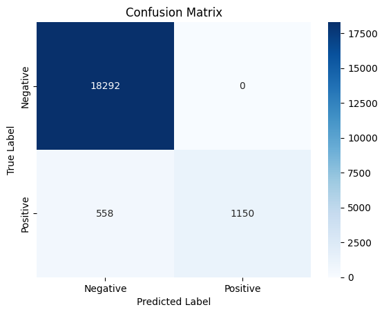

# Diabetes Detection Machine Learning Model

This project uses machine learning to predict whether a person has diabetes based on certain medical features. The model was trained on a publicly available dataset and tested using various classification algorithms to achieve high accuracy in predicting diabetes.

## Project Overview

The main goal of this project is to build a machine learning model that predicts diabetes from a set of diagnostic measures. It uses a dataset containing medical data such as age, BMI, insulin levels, glucose levels, and more. The project includes data preprocessing, model training, evaluation, and output generation.

## Table of Contents
- [Technologies Used](#Technologies-Used)
- [Dataset](#Dataset)
- [Files Structure](#files-structure)
- [Requirements](#requirements)
- [How to Run](#how-to-run)
- [Results](#results)
- [License](#license)

## Technologies Used

- **Python** (Programming Language)
- **Jupyter Notebook** (For interactive development)
- **Pandas** (Data manipulation)
- **NumPy** (Numerical operations)
- **Scikit-learn** (Machine learning algorithms)
- **Matplotlib** & **Seaborn** (Data visualization)
- **TensorFlow** or **PyTorch** (For model building, if used)

## Dataset

The dataset used in this project is a **diabetes dataset** from the [Diabetes prediction dataset](https://www.kaggle.com/datasets/iammustafatz/diabetes-prediction-dataset), which contains medical records of patients and whether or not they have diabetes.

- **Features:**
  - Gender
  - Age
  - Hypertension
  - Heart Disease
  - Smoking History
  - HbA1c_level
  - BMI (Body Mass Index)
- **Target:** 1 (Diabetic) or 0 (Non-diabetic)

## Files Structure

```plaintext
diabetes-detection/
│
├── data/                        # Folder for storing datasets
│   └── dataset.csv              # Example dataset
│
├── notebooks/                   # Folder for Jupyter Notebooks
│   └── diabetes_detection.ipynb # Jupyter notebook containing the code
│
├── models/                      # Folder for saving the model
│   └── diabetes_model.pth       # Saved model file
│
├── outputs/                     # Folder for storing output files
│   └── outputcsv.csv            # Generated output CSV
│
├── requirements.txt             # List of required Python libraries (for reproducibility)
├── README.md                    # Project description
└── .gitignore                   # Git ignore file to exclude unnecessary files
```

## Requirements

To run this project locally, you'll need Python 3.x and the required libraries. You can install the dependencies using `pip`:

1. Clone the repository:
   ```bash
   git clone https://github.com/your-username/diabetes-detection.git
   ```

2. Install the required libraries:
   ```bash
   pip install -r requirements.txt
   ```

## How to Run

1. Navigate to the project directory:
   ```bash
   cd diabetes-detection
   ```

2. Launch the Jupyter notebook:
   ```bash
   jupyter notebook notebooks/diabetes_detection.ipynb
   ```

3. Follow the instructions in the notebook to preprocess the data, train the model, and evaluate its performance.

## Results

The model was evaluated using various classification algorithms such as **Logistic Regression**, **Decision Trees**, and **Support Vector Machines**. Here’s a brief summary of the results:

- **Accuracy:** 97.2%
- **Confusion Matrix:** (Shows performance in terms of true positives, false positives, true negatives, and false negatives)
- **Precision, Recall, F1-score:** (100%, 67.4%, 80.6%)

You can check the detailed analysis and model training process in the Jupyter notebook.

## Confusion Matrix

The confusion matrix for the model's predictions is shown below:



## License

### MIT License

**MIT License**  
Copyright (c) 2025 A.Jagan Karthick

Permission is hereby granted, free of charge, to any person obtaining a copy  
of this software and associated documentation files (the "Software"), to deal  
in the Software without restriction, including without limitation the rights  
to use, copy, modify, merge, publish, distribute, sublicense, and/or sell  
copies of the Software, and to permit persons to whom the Software is  
furnished to do so, subject to the following conditions:

The above copyright notice and this permission notice shall be included in all  
copies or substantial portions of the Software.

THE SOFTWARE IS PROVIDED "AS IS", WITHOUT WARRANTY OF ANY KIND, EXPRESS OR  
IMPLIED, INCLUDING BUT NOT LIMITED TO THE WARRANTIES OF MERCHANTABILITY,  
FITNESS FOR A PARTICULAR PURPOSE AND NONINFRINGEMENT. IN NO EVENT SHALL THE  
AUTHORS OR COPYRIGHT HOLDERS BE LIABLE FOR ANY CLAIM, DAMAGES OR OTHER  
LIABILITY, WHETHER IN AN ACTION OF CONTRACT, TORT OR OTHERWISE, ARISING  
FROM, OUT OF OR IN CONNECTION WITH THE SOFTWARE OR THE USE OR OTHER DEALINGS  
IN THE SOFTWARE.
